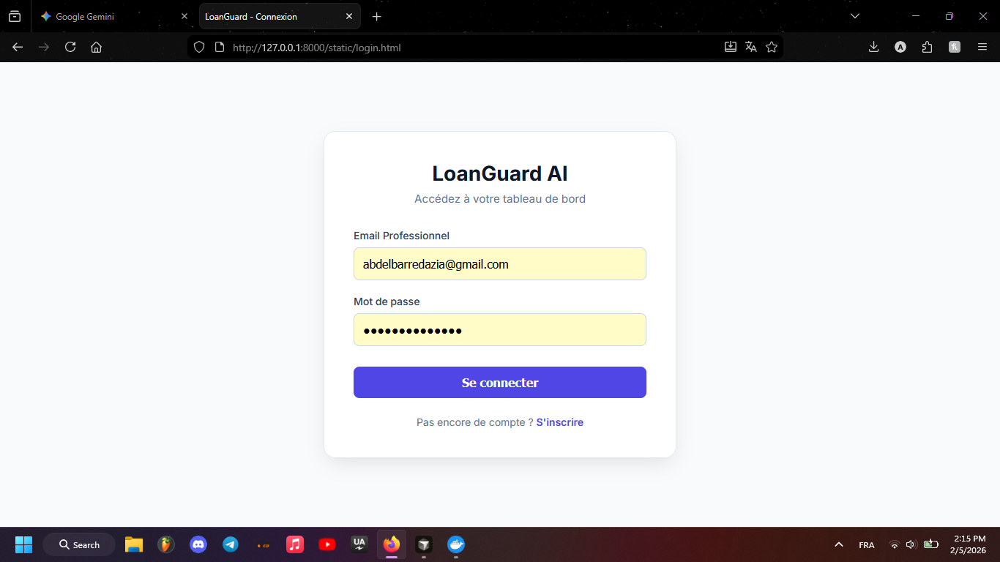
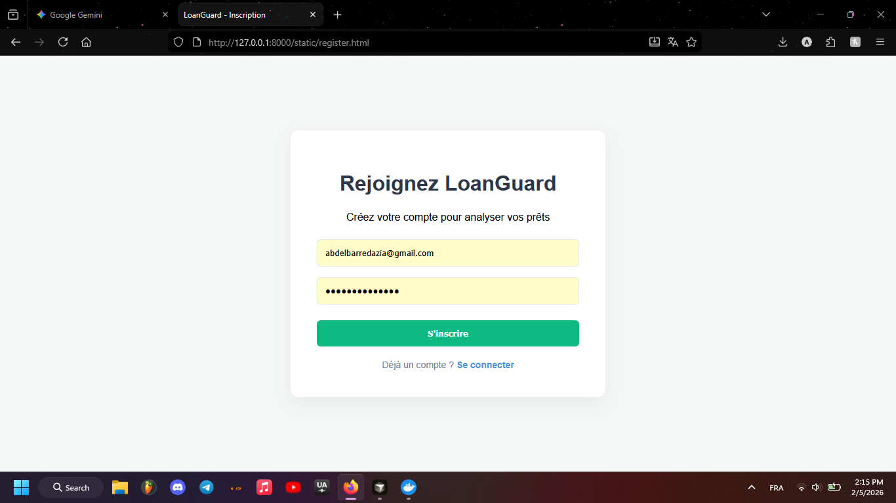
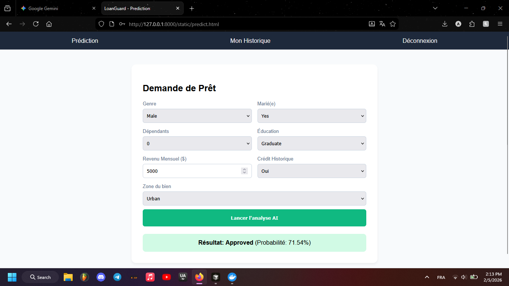
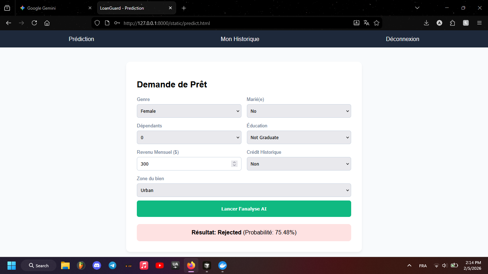
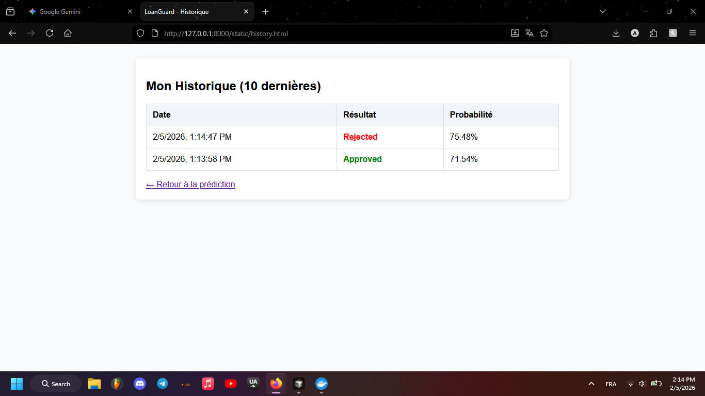

# 🛡️ LoanGuard AI: Smart Loan Prediction System

**LoanGuard AI** is a full-stack Machine Learning application designed to predict loan approvals based on user profiles. It uses a FastAPI backend, a PostgreSQL database for data persistence, and a Dockerized environment for seamless deployment.

---

## 🚀 Key Features

* **Machine Learning Integration:** Uses a trained Random Forest model to predict loan eligibility.
* **Secure Authentication:** JWT-based login and registration system with hashed passwords (Bcrypt).
* **User Dashboard:** Users can submit loan applications and view their personal prediction history.
* **Admin Panel:** Administrators can manage users and monitor system activity.
* **API Documentation:** Built-in Swagger UI for testing endpoints.
* **Containerized:** Fully Dockerized for easy setup and scaling.

---

## 🛠️ Tech Stack

| Component      | Technology                                     |
|----------------|------------------------------------------------|
| **Backend** | FastAPI (Python 3.12)                         |
| **Database** | PostgreSQL                                     |
| **ML Library** | Scikit-Learn, Pandas, Pickle                  |
| **Security** | JOSE (JWT), Passlib (Bcrypt)                  |
| **DevOps** | Docker, Docker Compose                        |

---

## 🏗️ Architecture Flow


The application follows a modern API-first architecture:
1. **Frontend:** Static HTML/JS files served via FastAPI.
2. **Backend:** FastAPI handles business logic and security.
3. **ML Layer:** Data is pre-processed and fed into the `.pkl` model for real-time inference.
4. **Data Layer:** PostgreSQL stores user credentials and prediction history.

---

## ⚙️ Installation & Setup

### Prerequisites
* Docker & Docker Compose installed.

### Steps to Run
1.  **Clone the repository:**
    ```bash
    git clone [https://github.com/yourusername/loanguard-ai.git](https://github.com/yourusername/loanguard-ai.git)
    cd loanguard-ai
    ```

2.  **Environment Variables:**
    Create a `.env` file in the root directory:
    ```env
    SECRET_KEY=your_super_secret_key
    DATABASE_URL=postgresql://diazpg:diazpg123@db:5432/loan_db
    ```

3.  **Launch with Docker:**
    ```bash
    docker-compose up --build
    ```

4.  **Access the App:**
    * **Web Interface:** `http://localhost:8000`
    * **API Docs (Swagger):** `http://localhost:8000/docs`

---

## 📊 Database Schema


The database consists of two main tables:
* **Users:** Stores email, hashed password, and role (admin/user).
* **Predictions:** Stores the input features, the model result (Approved/Rejected), and the probability score.

---

## 🛠️ Troubleshooting

* **Bcrypt Error:** If you encounter `AttributeError: module 'bcrypt' has no attribute '__about__'`, ensure you are using `bcrypt==4.0.1` in your requirements.
* **Model Not Found:** Ensure your model is saved at `./notebooks/model.pkl`.

---

## 📸 Project Preview (UI/UX)

Here is a glimpse of the **LoanGuard AI** interface:

| Login Page | Registration Page |
|------------|-------------------|
|  |  |

| Loan Application (Approved) | Loan Application (Rejected) |
|-----------------------------|-----------------------------|
|  |  |

| User History |
|--------------|
|  |

---